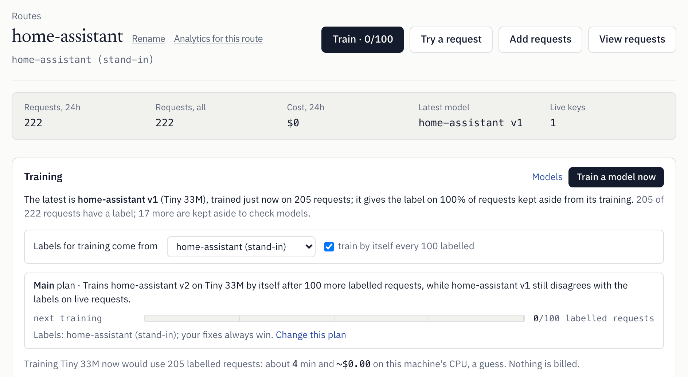
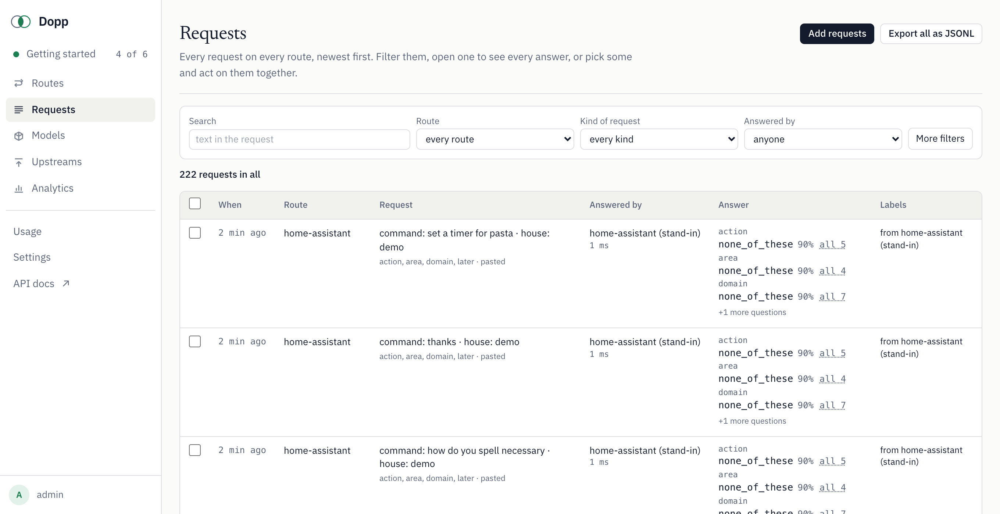
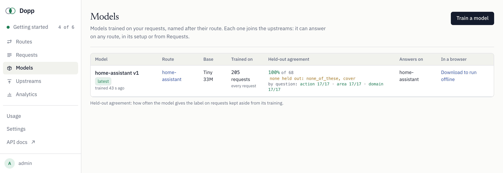

<div align="center">

<picture>
  <source media="(prefers-color-scheme: dark)" srcset="docs/header-dark.svg">
  
</picture>

[**Demo**](https://gatekeeper.dopp.sh/?ref=github-readme) · [Quickstart](#quickstart) · [How it works](#how-it-works) · [Website](https://dopp.sh/?ref=github-readme) · [Twitter](https://x.com/justkrup)

[](https://github.com/doppsh/dopp/actions/workflows/test.yml) [](LICENSE) 

</div>

<br>

Dopp is a proxy for Jev-compatible decision APIs. Point your app's base URL at it instead of Jev: the requests and replies
stay the same, and every request is kept. Label them, or pick an LLM or any other service to label them for you. Then train a
small open model on them on your own CPU and let it answer, with Jev as the fallback. The model also runs offline or in a
browser tab.

## Quickstart

See the whole loop in about three minutes, with no keys or accounts. You need Node 22+ and [uv](https://docs.astral.sh/uv/):

```sh
git clone https://github.com/doppsh/dopp && cd dopp
npm install
npm run example:home-assistant
```

It starts a local Dopp with a throwaway database and a stand-in service, sends Home Assistant voice commands through the
proxy, trains Tiny on your CPU, downloads the offline folder and asks it every command. Add `-- --keep` to look around the
dashboard afterwards. The first run also installs PyTorch and downloads bge-small (about 130 MB).

To use it with your own app, [run it on your machine](#run-it-on-your-machine) and [point your app at it](#point-your-app-at-it).
If you'd rather not run anything, [dopp.sh](https://dopp.sh) is the same product, hosted.

## How it works

<div align="center">

<picture>
  <source media="(prefers-color-scheme: dark)" srcset="docs/hero-dark.svg">
  
</picture>

<picture>
  <source media="(prefers-color-scheme: dark)" srcset="docs/screenshot-route-dark.png">
  
</picture>

</div>

Jev is TypeSafe's hosted decision API (`POST https://api.typesafe.ai/v1/systemone`). You send a `state` (text or any JSON)
and a few typed questions about it: `choice` (pick one option), `noul` (yes or no) and `score` (a point on a scale). You get
back an answer to each, with a probability for every option. Any server that takes and returns that shape is
"Jev-compatible".

What Dopp adds:

- **Every request is kept** as a training example, in a request log that shows who answered, how long it took, and why a
  fallback fired.
- **Routes and setups.** Each key belongs to a route. The route's setup decides who answers (Jev, another Jev-compatible
  service, an LLM, or a model you trained), what happens when one is unsure or slow, and who labels the requests a model
  learns from: you by default (fix or confirm an answer on the Requests page), or an LLM or any upstream you pick.
- **Train small open models on your own requests**: Tiny (bge-small, 34 MB int8) on your own CPU in a few minutes, or
  Laya, GLiNER and Kev on GPUs. Each version is measured against what answers today on requests it never saw.
- **Run them where you want**: as an offline folder that answers `/v1/systemone` with no network (a laptop, a Raspberry
  Pi), in the browser (WebGPU), or hosted on your own GPUs (Modal).

The numbers in the animation are from the repo's own [Home Assistant example](examples/home-assistant)
(`npm run example:home-assistant`, measured on a laptop, 30 Sep 2026): 222 voice commands in the
[HA-Jev](https://github.com/AboveColin/HA-Jev) shape with the label written next to each one, a Tiny model trained on 205 of
them on the CPU in about 60 s. On 68 held-out answers it agrees 100% of the time, at 1.8 ms a request. Those are template
commands, so it's an easy test; the same loop on real commands from a real house is written up, with its numbers, at
[dopp.sh/blog/run-jev-offline](https://dopp.sh/blog/run-jev-offline/).

This repo is the whole self-hosted product: the proxy and API (a Cloudflare Worker you can run locally), the dashboard, the
trainers, the browser runtime and the offline server. It's built for one operator. There's no sign-up: you set a password and
make the keys your apps use.

> It's early. The same loop runs end to end on every commit, in [CI](.github/workflows/test.yml), as the
> [Home Assistant example](examples/home-assistant).

## Run it on your machine

You need Node 22 or newer. You don't need a Cloudflare account or a GPU.

```sh
npm install
cp worker/.dev.vars.example worker/.dev.vars
```

In `worker/.dev.vars`, set:

- `ADMIN_PASSWORD`: the dashboard's password, at least 12 characters.
- `KEY_SECRET`: any long random string (`openssl rand -hex 32`). It encrypts keys you paste into the dashboard.
- Who answers: `TYPESAFE_API_KEY` (your TypeSafe key), or `JEV_URL` pointing at any Jev-compatible server. Without one of
  these, requests are kept but nobody answers them.

Then:

```sh
npm run dev
```

This builds the dashboard, creates a local database (SQLite, in `.wrangler/`) and serves everything at
**http://localhost:8787**.

1. Open http://localhost:8787 and sign in with `ADMIN_PASSWORD`.
2. **Getting started** makes your first route and shows its key (`us_…`), with a request you can paste into a terminal.
3. Send a request:

   ```sh
   DOPP_KEY=us_...
   curl http://localhost:8787/v1/systemone \
     -H "Authorization: Bearer $DOPP_KEY" -H "content-type: application/json" \
     -d '{"state":"My card was charged twice.","questions":{"refund":{"type":"noul","instructions":"Does the customer want money back?"}}}'
   ```

4. Open **Requests**: the request is there, with who answered and how long it took.

<picture>
  <source media="(prefers-color-scheme: dark)" srcset="docs/screenshot-requests-dark.png">
  
</picture>

`npm test` checks all of this end to end, against a stand-in for Jev and a throwaway database, with no keys.

## Point your app at it

Change the base URL from `https://api.typesafe.ai` to your Dopp server, and the API key to a route key. To have TypeSafe
bill your own key for a request instead of the server's, also send it as the `x-jev-key` header (forwarded, never stored).
The API is documented at `/docs.md` on your server and in `/openapi.json`.

Only keys made on your server get in. Anyone holding one can spend the upstream keys set on your server, so treat them
like API secrets and revoke any you've shared from the route's page.

## Train on your own machine

Tiny trains on your CPU, with no GPU and no Modal account. It takes a few minutes for a few hundred requests on a laptop.
With [uv](https://docs.astral.sh/uv/) installed:

1. Add to `worker/.dev.vars`:

   ```sh
   TINY_ENGINE_URL=http://127.0.0.1:8788
   SELF_URL=http://localhost:8787
   MODAL_SECRET=<any long random string>   # the Worker and the trainer check it on every call
   ```

2. In a second terminal: `npm run trainer`. The first run installs PyTorch and downloads bge-small (about 130 MB).
3. Restart `npm run dev`. On **Models**, Tiny is ready, priced at $0, on this machine's CPU.

<picture>
  <source media="(prefers-color-scheme: dark)" srcset="docs/screenshot-models-dark.png">
  
</picture>

A trained version downloads from the Models page as an offline folder; see [Offline folder](#offline-folder). Without uv, use
Python 3.10 to 3.12: `pip install -r engines/requirements-tiny.txt`, then `python engines/tiny_local.py`.

To see the whole loop without touching the dashboard, run an example:

- [Home Assistant](examples/home-assistant): voice commands in, an offline folder that answers them. `npm run example:home-assistant`
- [The Gatekeeper](examples/gatekeeper): a castle guard's brain, trained here and run in a browser tab with `browser/tiny.js`.
  `npm run example:gatekeeper`

## Train with your own Modal

Laya, GLiNER and Kev train on GPUs, on [Modal](https://modal.com), on your account. Without it Dopp still proxies, logs,
labels, compares and trains Tiny on your CPU, and the dashboard says which engines aren't deployed on your server.

1. `pip install modal && modal setup`
2. Make the shared secret the engines and the Worker use to trust each other (pick any long random value):

   ```sh
   modal secret create dopp-engine UNDERSTUDY_SECRET=<value>
   ```

   and set the same value as `MODAL_SECRET` (in `worker/.dev.vars`, or `npx wrangler secret put MODAL_SECRET -c worker/wrangler.toml`).
3. Deploy the engines you want, from the repo root:

   | Engine | Command | Trains on | Serves on |
   |---|---|---|---|
   | Laya (and Laya multilingual) | `modal deploy engines/modal_engine.py` | H100 | T4 |
   | Tiny (bge-small + one head per question) | `modal deploy engines/modal_tiny.py` | T4 | your machine (offline folder) |
   | GLiNER (small, Decide) | `modal deploy engines/modal_gliner.py` | A10G | T4 |
   | Kev (0.8B, 4B) | clone github.com/jaredpalmer/kev to `kev-repo/` (or set `KEV_ROOT`), then `modal deploy engines/modal_kev.py` | H100 | T4 |
   | Open models, untrained (JevK5) | `modal deploy engines/modal_open.py` | none | L4 |

4. Put the URLs Modal prints into `worker/wrangler.toml` (`ENGINE_URL`, `TINY_ENGINE_URL`, `GLINER_ENGINE_URL`, …; the
   commented lines show which is which) and restart.
5. Set `SELF_URL` in `worker/wrangler.toml` to an address Modal can reach. After training, Modal sends the version's files
   (the offline folder, the browser copy) back there. A server on localhost can still train, but those files can't come
   back until it has a public address: deploy it (below), or run a tunnel such as
   `cloudflared tunnel --url http://localhost:8787` and use the address it prints.

Modal bills you by the second for GPU time; the Usage page shows what each run and each awake hour cost at Modal's list
prices. Engines scale to zero when idle.

## Offline folder

A trained Tiny version downloads as a folder (model, tokenizer, `tiny.json`, `serve.py`) from the Models page. It answers
`POST /v1/systemone` like Jev, with no network, on any machine with Python (Linux ARM included). Inside the folder:

```sh
pip install onnxruntime tokenizers numpy
python serve.py --port 8799
```

It listens on port 8787 unless told otherwise, the same port as `npm run dev`, hence `--port` above. `serve.py` is a copy of
`engines/tiny_serve.py`. To have Dopp ask it, set `JEV_URL=http://127.0.0.1:8799/v1/systemone`.

## In the browser

A Tiny offline folder also runs in a browser tab: `browser/tiny.js` (with `browser/wordpiece.js`, no other dependencies)
loads it with ONNX Runtime Web and answers like `serve.py` (same tokens and choices; probabilities within a few hundredths). The [Gatekeeper example](examples/gatekeeper) shows it in a
bare page.

Trained Laya versions also get a browser copy (ONNX, run on WebGPU by `dashboard/public/laya-web.js`), which the Worker
serves only to you. Like the offline folder, it is sent back to `SELF_URL` after training.

## Deploy to your Cloudflare account

```sh
npx wrangler login
npx wrangler d1 create dopp                 # put the id in worker/wrangler.toml
npx wrangler r2 bucket create dopp-files    # keep it private
npm run deploy:db
npx wrangler secret put ADMIN_PASSWORD -c worker/wrangler.toml
npx wrangler secret put KEY_SECRET -c worker/wrangler.toml     # and TYPESAFE_API_KEY and the others you use
npm run deploy
```

Set `SELF_URL` in `worker/wrangler.toml` to the address it's served at. The dashboard asks for `ADMIN_PASSWORD`, so pick
a long one: wrong guesses are slowed down, but only within each Worker instance. To put the whole dashboard behind your own login as well, Cloudflare Access works in
front of it; leave `/v1/systemone` open to your apps.

## Configuration

Secrets (names only; see `worker/.dev.vars.example`): `ADMIN_PASSWORD`, `KEY_SECRET`, `TYPESAFE_API_KEY`, `MODAL_SECRET`,
`GEN_API_KEY` (with `GEN_BASE_URL` and `GEN_MODEL` for a writer other than Gemini), `OPENROUTER_API_KEY`.

Vars (`worker/wrangler.toml`): `SELF_URL`, `JEV_URL`, `PRICE_MARGIN` (cost shown = list price times this; default 1), the
engine URLs, `REQUESTS_PER_MINUTE_PER_KEY` (default 120), and `RESPONSE_META=off` to leave Dopp's `understudy` block out of
replies for clients that reject unknown fields.

## Layout

| Folder | What |
|---|---|
| `worker/` | The Cloudflare Worker: proxy, routing, request log, training orchestration, sign-in, API. D1 migrations in `worker/migrations/`. |
| `dashboard/` | The dashboard (Vite + React): routes, requests, models, training, compare, upstreams, usage. |
| `engines/` | Modal apps that train and serve models, and `tiny_serve.py`, the offline server. |
| `laya_ft/` | Laya fine-tuning used by the Laya engine. |
| `browser/` | The in-browser runtimes (`tiny.js` for a Tiny offline folder, `laya-web.js` for Laya on WebGPU) and the ONNX exporters. |
| `scripts/` | `smoke.mjs`, the end-to-end check behind `npm test`, and the throwaway local server it and the examples use. |
| `examples/` | Whole loops you can run: requests in, a model trained on this machine, the offline folder answering. |

## Models and their licenses

Dopp downloads base weights from Hugging Face when an engine is built; this repo contains no weights.

| Base | Weights | License |
|---|---|---|
| Laya 0.4B | convaiinnovations/laya | Apache-2.0 |
| Laya multilingual 0.3B | convaiinnovations/laya-multilingual | Apache-2.0 |
| GLiNER2.5-Decide 0.49B | fastino/GLiNER2.5-Decide | Apache-2.0 |
| GLiNER2 small 0.21B | fastino/gliner2-base-v1 | Apache-2.0 |
| Kev 0.8B / 4B | jaredpalmer/kev-0.8b, kev-4b (on Qwen3.5 base models, Apache-2.0); training code github.com/jaredpalmer/kev | Apache-2.0 |
| JevK5 4B | alibiserikbay/JevK5 | Apache-2.0 |
| Tiny | BAAI/bge-small-en-v1.5 | MIT |

Python packages the engines install: `laya` (Apache-2.0), `gliner2` (Apache-2.0), PyTorch, Transformers, ONNX Runtime.
Jev is TypeSafe's hosted API and is not part of this repo.

## What dopp.sh adds

The hosted version adds accounts and sign-up, GPUs and provider keys already set up, one bill instead of your own provider
accounts, and hosting subscriptions for trained models. Those parts aren't in this repo.

## License

MIT, see [LICENSE](LICENSE).

---

Made by [@justkrup](https://x.com/justkrup). Hosted version: [dopp.sh](https://dopp.sh).

<sub>The name is short for *doppelgänger*: a double of a living person. Here, a model of your own that answers your app's questions, on your hardware.</sub>
